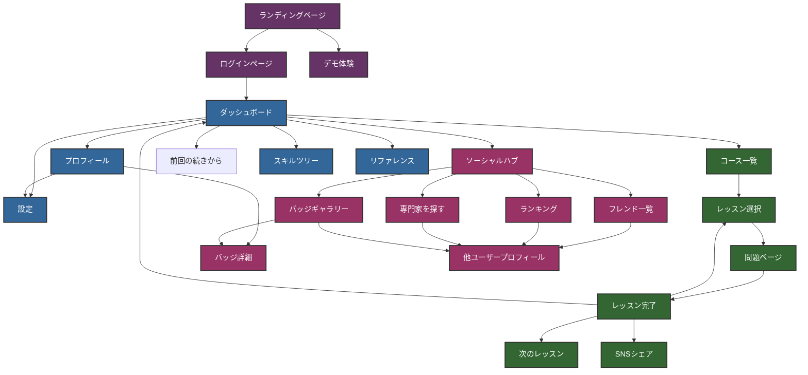
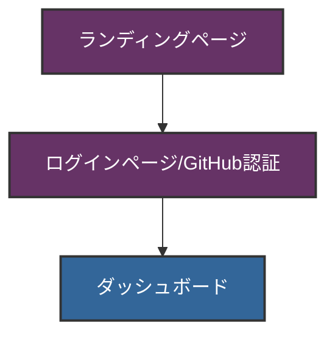
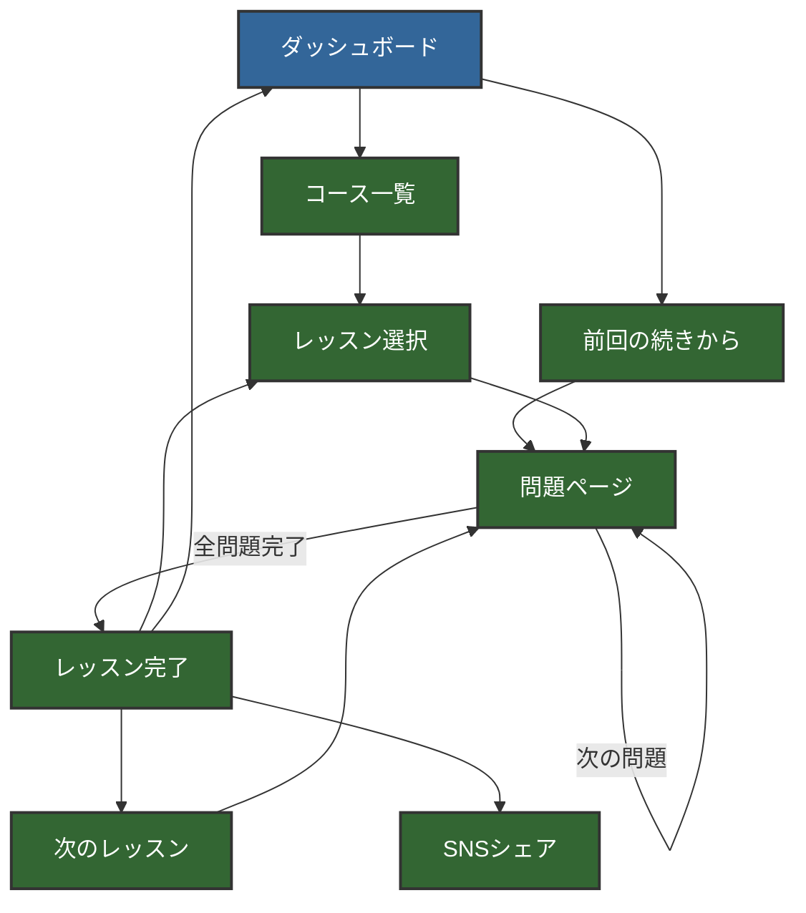
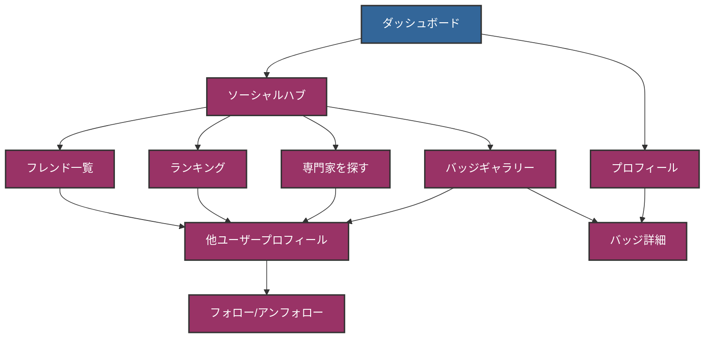
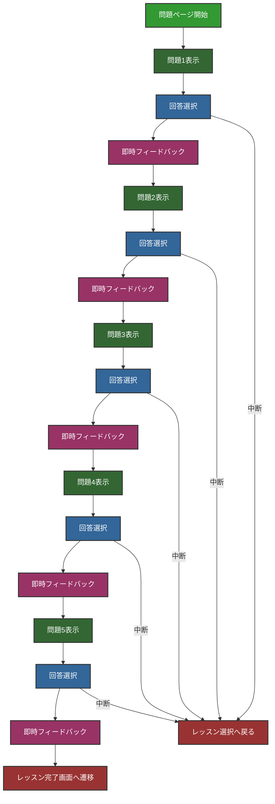
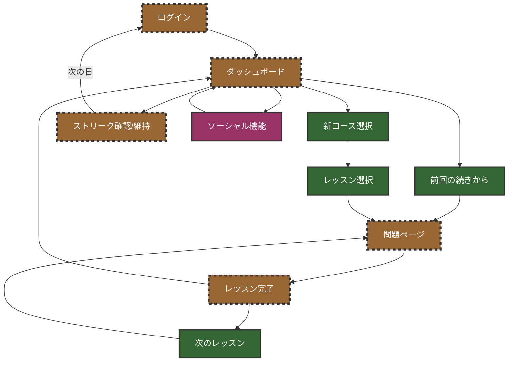
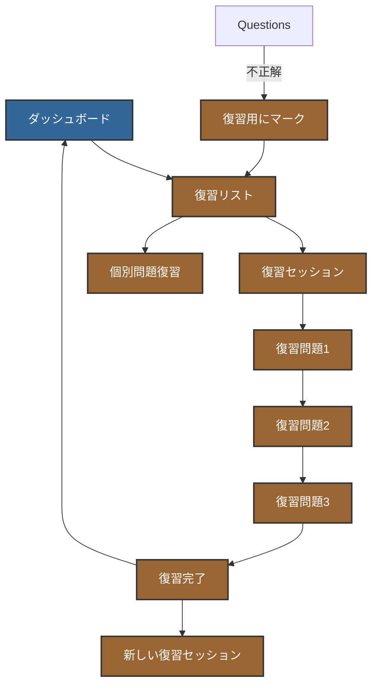

# MKDuo アプリケーション ページフロー図

## 1. 全体ページフロー

## 2. 認証フロー

## 3. 学習フロー

## 4. ソーシャルフロー

## 5. 問題ページ内部フロー (SPA)

## 6. リピートユーザーのサイクル

## 7. 復習フロー

注: これらのフロー図はMermaidシンタックスで記述されています。GitHubやその他のMarkdownビューアでレンダリングして確認できます。
